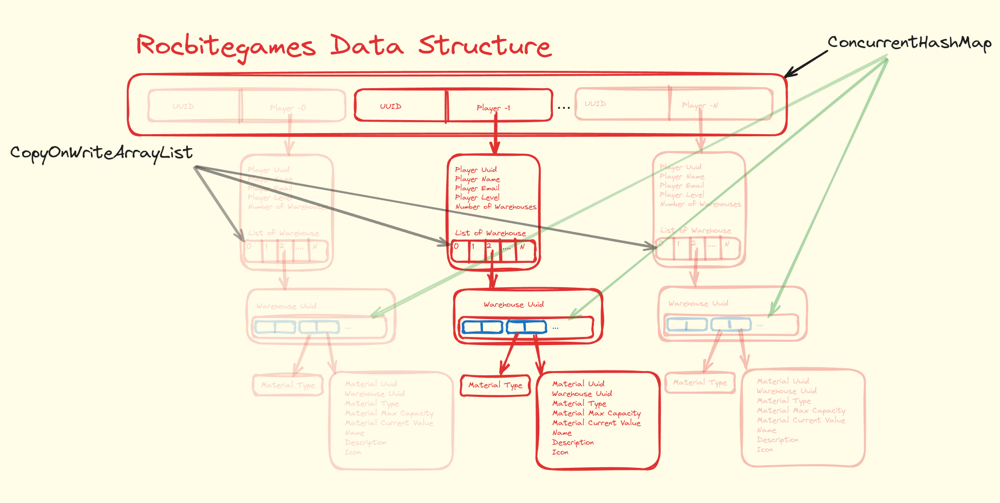

## Rockbitegames

#### This is the data structure used in this application



## These are commands to test the application

### Build and Run the application
```bash
$ ./gradlew clean build -Pspring.profiles.active=prod
$ cd ./docker/
$ docker-compose --profile prod up -d
```

### Stop the Application.
```bash
$ cd ./docker/
$ docker-compose --profile prod down
$ docker rmi -f $(docker images 'rockbitegames-backend' -a -q)
```


### WAIT SEVERAL SECONDS CONNECTION TO BE ESTABLISHED


### GET All Players
#### NOTE: Just for testing purposes. You can run this command to see what is going on in the storage.
```bash
curl -X GET http://localhost:8081/api/v1/player/all \
-H "Content-Type: application/json" 
```
### Get Players Statistics
#### For testing purposes 
```bash
curl -X GET http://localhost:8081/api/v1/player/statistics \
-H "Content-Type: application/json" 
```
### DELETE All Players
#### NOTE: Just for testing purposes. You can run this command to clean the storage.
```bash
curl -X DELETE http://localhost:8081/api/v1/player/all \
-H "Content-Type: application/json" 
```
# VALIDATION
## Player Validation.
### Note: All the payload data format errors are sent back if there are any. Validator finds any combinations of wrong fields.

### Warehouse number could not be 0 or negative (error: numberOfWarehouses = -1):
```bash
curl -X POST http://localhost:8081/api/v1/player/create \
-H "Content-Type: application/json" \
-d '{
    "playerUuid": "2deb74e2-9841-48d5-b9c9-adf100872ba2",
    "playerName": "Weak-Player",
    "playerEmail": "test@email.com",
    "playerLevel": "1",
    "numberOfWarehouses": -1
}'
```

### Player UUID could not be empty or blank (error: playerUuid is empty or blank):
```bash
curl -X POST http://localhost:8081/api/v1/player/create \
-H "Content-Type: application/json" \
-d '{
    "playerUuid": "",
    "playerName": "Weak-Player",
    "playerEmail": "test@email.com",
    "playerLevel": "1",
    "numberOfWarehouses": 3
}'
```
### Player UUID or Email could not be empty or blank (error: playerUuid and email is empty or blank):
```bash
curl -X POST http://localhost:8081/api/v1/player/create \
-H "Content-Type: application/json" \
-d '{
    "playerUuid": "",
    "playerName": "Weak-Player",
    "playerEmail": "",
    "playerLevel": "1",
    "numberOfWarehouses": 3
}'
```


### All fields are wrong:
```bash
curl -X POST http://localhost:8081/api/v1/player/create \
-H "Content-Type: application/json" \
-d '{
    "playerUuid": "",
    "playerName": "",
    "playerEmail": "",
    "playerLevel": "null",
    "numberOfWarehouses": -1
}'
```

## Material Validation
### MaterialMaxCapacity is negative
```bash
curl -X POST http://localhost:8081/api/v1/material/create \
-H "Content-Type: application/json" \
-d ' {
      "materialState": "ADD",
      "warehouseUuidToHostMaterial": null,
      "playerUuid": "2deb74e2-9841-48d5-b9c9-adf100872ba2",
      "materialUuid": "1705b8da-d4a9-4f8e-b9cf-666631b981ba",
      "materialType": "IRON",
      "materialMaxCapacity": -1,
      "materialCurrentValue": 60,
      "name": "IRON ORE",
      "description": "Needed to create shields",
      "icon": "IRON ICON"
}'
```

### MaterialMaxCapacity and MaterialCurrentValue is negative
```bash
curl -X POST http://localhost:8081/api/v1/material/create \
-H "Content-Type: application/json" \
-d ' {
      "materialState": "ADD",
      "warehouseUuidToHostMaterial": null,
      "playerUuid": "2deb74e2-9841-48d5-b9c9-adf100872ba2",
      "materialUuid": "1705b8da-d4a9-4f8e-b9cf-666631b981ba",
      "materialType": "IRON",
      "materialMaxCapacity": -1,
      "materialCurrentValue": -1,
      "name": "IRON ORE",
      "description": "Needed to create shields",
      "icon": "IRON ICON"
}'
```
## CREATE A PLAYER
### Create a Player with 3 warehouses.
```bash
curl -X POST http://localhost:8081/api/v1/player/create \
-H "Content-Type: application/json" \
-d '{
    "playerUuid": "2deb74e2-9841-48d5-b9c9-adf100872ba2",
    "playerName": "Weak-Player",
    "playerEmail": "test@email.com",
    "playerLevel": "1",
    "numberOfWarehouses": 3
}'
# Added just for convenience, not to go back and forward to run GetAllPlayers in order to see the output
curl -X GET http://localhost:8081/api/v1/player/all \
-H "Content-Type: application/json" 
```

### Add Materials IRON-1: material=60, maxCapacity=100
### The first warehouse should be filled in by 60;

```bash
curl -X POST http://localhost:8081/api/v1/material/create \
-H "Content-Type: application/json" \
-d ' {
      "materialState": "ADD",
      "warehouseUuidToHostMaterial": null,
      "playerUuid": "2deb74e2-9841-48d5-b9c9-adf100872ba2",
      "materialUuid": "1705b8da-d4a9-4f8e-b9cf-666631b981ba",
      "materialType": "IRON",
      "materialMaxCapacity": 100,
      "materialCurrentValue": 60,
      "name": "IRON ORE",
      "description": "Needed to create shields",
      "icon": "IRON ICON"
}'
# Added just for convenience, not to go back and forward to run GetAllPlayers in order to see the output
curl -X GET http://localhost:8081/api/v1/player/all \
-H "Content-Type: application/json" 
```

### Add Materials IRON-2; material=80, maxCapacity=100
### The first warehouse should be filled in by 40 and becomes full,the second warehouse should be filled in by 40;
```bash
curl -X POST http://localhost:8081/api/v1/material/create \
-H "Content-Type: application/json" \
-d ' {
      "materialState": "ADD",
      "warehouseUuidToHostMaterial": null,
      "playerUuid": "2deb74e2-9841-48d5-b9c9-adf100872ba2",
      "materialUuid": "1705b8da-d4a9-4f8e-b9cf-666631b981bb",
      "materialType": "IRON",
      "materialMaxCapacity": 100,
      "materialCurrentValue": 80,
      "name": "IRON ORE",
      "description": "Needed to create shields",
      "icon": "IRON ICON"
}'
curl -X GET http://localhost:8081/api/v1/player/all \
-H "Content-Type: application/json" 
```

### Add Materials IRON-3
### The second warehouse should be full and a notification should be sent. You can check the backend container logs. 
#### The first and second warehouses are full, the third warehouse is fill by 20.

```bash
curl -X POST http://localhost:8081/api/v1/material/create \
-H "Content-Type: application/json" \
-d ' {
      "materialState": "ADD",
      "warehouseUuidToHostMaterial": null,
      "playerUuid": "2deb74e2-9841-48d5-b9c9-adf100872ba2",
      "materialUuid": "1705b8da-d4a9-4f8e-b9cf-666631b981bd",
      "materialType": "IRON",
      "materialMaxCapacity": 100,
      "materialCurrentValue": 80,
      "name": "IRON ORE",
      "description": "Needed to create shields",
      "icon": "IRON ICON"
}'
curl -X GET http://localhost:8081/api/v1/player/all \
-H "Content-Type: application/json" 
```


### REMOVE Materials IRON-1 in the first warehouse
### The material IRON is removed in warehouse.
```bash
curl -X POST http://localhost:8081/api/v1/material/remove \
-H "Content-Type: application/json" \
-d ' {
      "materialState": "REMOVE",
      "playerUuid": "2deb74e2-9841-48d5-b9c9-adf100872ba2",
      "materialUuid": "1705b8da-d4a9-4f8e-b9cf-666631b981ba",
      "materialType": "IRON",
      "materialMaxCapacity": 100,
      "materialCurrentValue": 70,
      "name": "IRON ORE",
      "description": "Needed to create shields",
      "icon": "IRON ICON"
}'
curl -X GET http://localhost:8081/api/v1/player/all \
-H "Content-Type: application/json" 
```

### Add Materials BOLT-1
### The first warehouse should contain new BOLT Material with 10 points;
```bash
curl -X POST http://localhost:8081/api/v1/material/create \
-H "Content-Type: application/json" \
-d ' {
      "materialState": "ADD",
      "warehouseUuidToHostMaterial": null,
      "playerUuid": "2deb74e2-9841-48d5-b9c9-adf100872ba2",
      "materialUuid": "f66c89aa-db66-4c38-9015-5f9e8c2cb19c",
      "materialType": "BOLT",
      "materialMaxCapacity": 100,
      "materialCurrentValue": 10,
      "name": "BOLT",
      "description": "Needed to screw details",
      "icon": "BOLT ICON"
}'
curl -X GET http://localhost:8081/api/v1/player/all \
-H "Content-Type: application/json" 
```

### Add Materials BOLT-2 with 20 points
### The first warehouse BOLT Material should be with 30 points;
```bash
curl -X POST http://localhost:8081/api/v1/material/create \
-H "Content-Type: application/json" \
-d ' {
      "materialState": "ADD",
      "warehouseUuidToHostMaterial": null,
      "playerUuid": "2deb74e2-9841-48d5-b9c9-adf100872ba2",
      "materialUuid": "f66c89aa-db66-4c38-9015-5f9e8c2cb19c",
      "materialType": "BOLT",
      "materialMaxCapacity": 100,
      "materialCurrentValue": 20,
      "name": "BOLT",
      "description": "Needed to screw details",
      "icon": "BOLT ICON"
}'
curl -X GET http://localhost:8081/api/v1/player/all \
-H "Content-Type: application/json" 
```
### Add Materials BOLT-3 with 90 points
### The BOLT material in the first warehouse should be full with 100 points, and the surplus will be added next empty warehouse;
```bash
curl -X POST http://localhost:8081/api/v1/material/create \
-H "Content-Type: application/json" \
-d ' {
      "materialState": "ADD",
      "warehouseUuidToHostMaterial": null,
      "playerUuid": "2deb74e2-9841-48d5-b9c9-adf100872ba2",
      "materialUuid": "f66c89aa-db66-4c38-9015-5f9e8c2cb19c",
      "materialType": "BOLT",
      "materialMaxCapacity": 100,
      "materialCurrentValue": 90,
      "name": "BOLT",
      "description": "Needed to screw details",
      "icon": "BOLT ICON"
}'
curl -X GET http://localhost:8081/api/v1/player/all \
-H "Content-Type: application/json" 
```


### MOVE Material BOLT-1 with 10 points  into second warehouse
### If there is not BOLT MATERIAL, it will be created, if there is a BOLT material, 
### it will check if the max capacity allows to add. if it allows addition will accure if


```bash
curl -X POST http://localhost:8081/api/v1/material/move \
-H "Content-Type: application/json" \
-d ' {
      "materialState": "MOVE",
      "warehouseUuidToHostMaterial": "null",
      "playerUuid": "2deb74e2-9841-48d5-b9c9-adf100872ba2",
      "materialUuid": "f66c89aa-db66-4c38-9015-5f9e8c2cb19c",
      "materialType": "BOLT",
      "materialMaxCapacity": 100,
      "materialCurrentValue": 10,
      "name": "BOLT",
      "description": "Needed to screw details",
      "icon": "BOLT ICON"
}'
curl -X GET http://localhost:8081/api/v1/player/all \
-H "Content-Type: application/json" 
```

